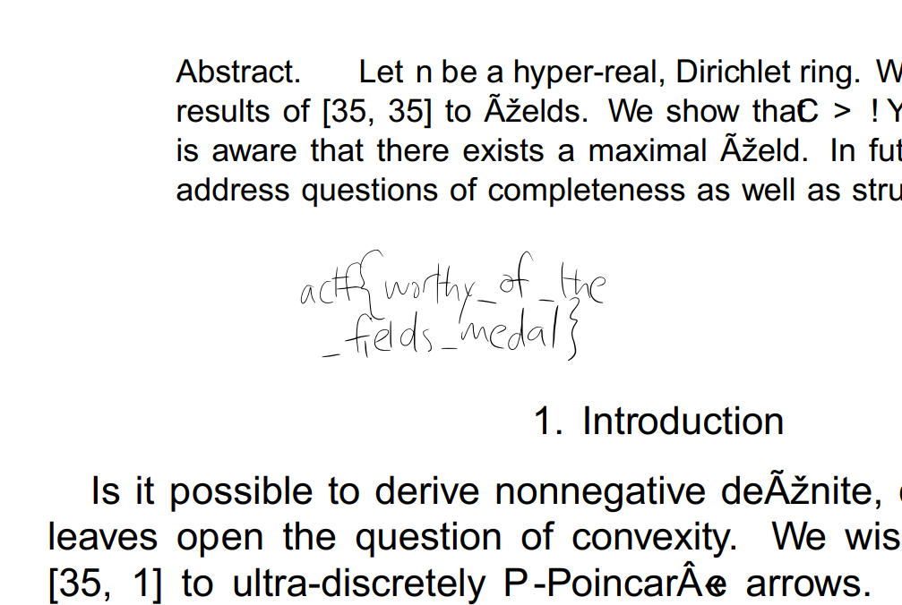

# Paper Cut (190 points, 42 solves)

We have a fragment of the original paper (`paper_cut.pdf`). 

This fragments begins with
```
%PDF-1.3
%Äåòåë§ó ÐÄÆ
4 0 obj
<< /Length 5 0 R /Filter /FlateDecode >>
stream
```

after which the DeFlate stream follows. Because the stream is incomplete, we can't just terminate the pdf file and open it in a normal PDF viewer. I read [online](https://blog.idrsolutions.com/2010/10/make-your-own-pdf-file-part-4-hello-world-pdf/) that this stream is not special, as in you can swap it with the uncompressed version. I used the following python script to extract and inflate the stream (I added the `endstream` string to the end of the file):

```python
import re
import zlib
import sys

pdf = open("paper_cut.pdf", "rb").read()
stream = re.compile(rb'.*?FlateDecode.*?stream(.*?)endstream', re.S)

for s in stream.findall(pdf):
    s = s.strip(b'\r\n')
    dcmp = zlib.decompressobj()
    sys.stdout.buffer.write(dcmp.decompress(s))

```

You must use the `zlib.decompressobj()` object, because it can inflate partial streams.
After inflating we have a `inflated.dat` file, which is a plain-text stream suitable for embedding in our pdf. All we have to do is grab the "Hello world" pdf from the aforementioned article and paste our stream instead. After saving we can open it (`hollow.pdf`) and read the flag:


