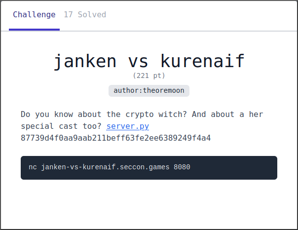

# janken vs kurenaif
## Chall Author: theoremoon

## Description

Do you know about the crypto witch? And about a her special cast too? [server.py](./server.py) 87739d4f0aa9aab211beff63fe2ee6389249f4a4

`nc janken-vs-kurenaif.seccon.games 8080`

 

## Solution

It relies on the fact that `random.randint(0, 2)` uses only the last 2 bits of
the MT19937 output.

Read the code and comments for full explanation.

Helper script: [test.py](./test.py)\
Solution: [solve.py](./solve.py)

### Writeup Author: MrQubo
