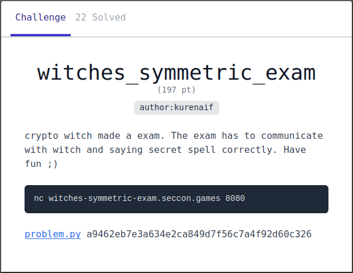

# witches\_symmetric\_exam
## Chall Author: kurenaif

## Description



crypto witch made a exam. The exam has to communicate with witch and saying
secret spell correctly. Have fun ;)

`nc witches-symmetric-exam.seccon.games 8080`

[problem.py](./problem.py) a9462eb7e3a634e2ca849d7f56c7a4f92d60c326

## Analysis

Try to analyze the challenge file ([problem.py](./problem.py)) to understand
what it does. The scripting language used is python3.

```python3
from Crypto.Cipher import AES
from Crypto.Random import get_random_bytes
from Crypto.Util.Padding import pad, unpad
```
The script imports `Crypto` module. This is probably from
[PyCryptodome](https://www.pycryptodome.org/) library.

```python3
from flag import flag, secret_spell
```
It also imports `flag` module. We're not given that and I doubt it's part of
some library so this probably means that `flag` and `secret_spell` are meant to
be unkown for players.

```python3
key = get_random_bytes(16)
nonce = get_random_bytes(16)
```
Two random byte-strings of length 16 are generated — `key` and `nonce`.

```python3
def encrypt():
    data = secret_spell
    gcm_cipher = AES.new(key, AES.MODE_GCM, nonce=nonce)
    gcm_ciphertext, gcm_tag = gcm_cipher.encrypt_and_digest(data)

    ofb_input = pad(gcm_tag + gcm_cipher.nonce + gcm_ciphertext, 16)

    ofb_iv = get_random_bytes(16)
    ofb_cipher = AES.new(key, AES.MODE_OFB, iv=ofb_iv)
    ciphertext = ofb_cipher.encrypt(ofb_input)
    return ofb_iv + ciphertext
```
We're given two functions, `encrypt()` and `'decrypt()`. The first one encrypts
`secret_spell`. The encryption works as follows:
1. The is encrypted with AES in GCM mode. GCM mode requires `key` and `nonce`.
	 GCM mode, apart from ciphertext it also returns an authentication tag, which
	 can only be computed by knowing `data`, `key`, and `nonce`, but unlike
	 `ciphertext` it's always 16 bytes long and cannot be used to decrypt oryginal
	 message. It's worth mentioning that GCM (as well as OFB and CTR) mode doesn't
	 require input length to be mupltiple of 16.
2. Tag, nonce, and ciphertext and concatenated and padded with standard PKCS7
	 padding to form `ofb_input`.
3. Random byte-string of length 16 is generated — `ofb_iv`.
4. `ofb_input` is encrypted with AES in OFB mode. OFB mode requires `key` and
	 `iv`. Worth noting is that the same `key` is used as the one in 1. step.
5. Both `ofb_iv` and the ciphertext from the last step are returned.

```python3
def decrypt(data):
    ofb_iv = data[:16]
    ofb_ciphertext = data[16:]
    ofb_cipher = AES.new(key, AES.MODE_OFB, iv=ofb_iv)

    try:
        m = ofb_cipher.decrypt(ofb_ciphertext)
        temp = unpad(m, 16)
    except:
        return b"ofb error"

    try:
        gcm_tag = temp[:16]
        gcm_nonce = temp[16:32]
        gcm_ciphertext = temp[32:]
        gcm_cipher = AES.new(key, AES.MODE_GCM, nonce=gcm_nonce)

        plaintext = gcm_cipher.decrypt_and_verify(gcm_ciphertext, gcm_tag)
    except:
        return b"gcm error"
```
`decrypt()` function works similarly, but in reverse:
1. `data` is splitted to `ofb_iv` and `ofb_ciphertext`.
2. Using `key` and `ofb_iv`, the ciphertext is decrypted by AES in OFB mode.
3. Decrypted data is unpadded.
4. Unpadded data is splitted into `gcm_tag`, `gcm_nonce` and `gcm_ciphertext`.
5. Using `key` and `gcm_nonce`, `gcm_ciphertext` is decrypted by AES in GCM mode
	 and `gcm_tag` is verified.
The important part is that whenever steps 2. or 3. fail, "ofb error" is
returned. Step 2. should never fail so this is plain and simple padding oracle
bug.

## Running locally

For debugging I had to run `problem.py` locally. For this we need to provide
some values for `flag` and `secret_spell`. You can create `flag.py` file or edit
`problem.py` directly:
```python3
#  from flag import flag, secret_spell
secret_spell = bytes(16)
flag = b'flag{fake}'
```

It's also a good idea to replace random `key`, `nonce`, and `iv` with some
constant values. This way encryption/decryption always give the same results and
it makes debugging easier.

## Solution

The base idea for exploit is the same as for any AES padding oracle bug. You can
find numerous explanations of how this attack works with CBC mode on the
internet, for example here:
[Exploiting CBC Padding Oracles](https://research.nccgroup.com/2021/02/17/cryptopals-exploiting-cbc-padding-oracles/)
What's important to notice when writing an exploit is that, unlike CBC, OFB mode
decryption __encrypts__ IV and xors the result with first ciphertext block. This
is unlike CBC mode which decrypts first ciphertext block and xors the result
with IV. But because we control both the input to AES and what's the results is
xored with, the exploits works the same way. But because OFB uses AES
encryption, this gives us the means to __encrypt__ any block we desire, and not
decrypt.

However, both OFB and GCM uses only AES block encryption to implement both
encryption and decryption. So given oracle that can encrypt any block we can
implement both encryption and decryption.

Here's a simple implementation of an encryption oracle implemented by exploiting
padding oracle bug (using [pwntools](https://pwntools.com)):
```python3
from pwn import *

io = remote('witches-symmetric-exam.seccon.games', 8080)
io.recvuntil('ciphertext: ')

def ofb_padding_oracle(iv, data):
    assert len(iv) == 16, iv
    assert len(data) == 16, data
    io.sendline(iv.hex() + data.hex())
    io.recvuntil('ciphertext: ')
    line = io.recvline(keepends=False)
    if line == b"b'ofb error'":
        return False
    elif line == b"b'gcm error'":
        return True
    assert False, line

def encrypt_oracle(pt):
    iv = bytes(pt)
    data = bytearray(16)
    for idx in reversed(range(16)):
        padi = 16 - idx
        for x in range(256):
            data[idx] = x
            if ofb_padding_oracle(iv, data):
                break
        else:
            assert False, idx
        for idx2 in range(idx, 16):
            data[idx2] ^= padi ^ (padi + 1)
    return bytes(x ^ 0x11 for x in data)
```

When iterating for the last byte in the block it's possible that the
second-to-last byte happens to be equal to \\x02. In this case the last byte
equal to both \\x02 and \\x01 will be considered a valid padding. This should
happen rarely, but we will need to call encryption oracle multiple times so it's
a good idea to make it failproof. The case of \\x02\\x02 padding can be verified
by changing the second-last byte to anything different. This will invalidate the
padding if the last byte is \\x02, because the second-to-last byte won't be
equal to \\x02 any longer. But for \\x01 padding the second-to-last byte can be
anything so it won't be invalidated. Here's a modified version of encryption
oracle with this check included:
```python3
def encrypt_oracle(pt):
    iv = bytes(pt)
    data = bytearray(16)
    for idx in reversed(range(16)):
        padi = 16 - idx
        for x in range(256):
            data[idx] = x
            if ofb_padding_oracle(iv, data):
                if idx == 15:
                    data[idx-1] ^= 1
                    if not ofb_padding_oracle(iv, data):
                        continue
                break
        else:
            assert False, idx
        for idx2 in range(idx, 16):
            data[idx2] ^= padi ^ (padi + 1)
    return bytes(x ^ 0x11 for x in data)
```

My final version of an encryption oracle sends multiple decryption requests in
one packet as network tends to be a bottleneck and this should hugely speed up
the exploit. After CTF I've tried to run my solution without this optimization
and gave up after waiting for ten minutes. With optimization it takes about 2
and a half minutes.

The only thing to do now is to implement OFB and GCM encryption and decryption
using our encryption oracle. It's a good idea to avoid implementing things like
that during CTF. As there are a lot of places for mistakes, you're probably
going in for long hours of debugging.
I couldn't find any implementation that would let me replace underlying block
encryption algorithm in a simple way. I've implemented OFB and CTR mode (CTR
mode is used by GCM) myself and was able to use the GCM implementation from
PyCryptodome. Be warned that the code for that is hacky and ugly.

Here's the final solution, it takes 2–3 minutes to complete:
[solve.py](./solve.py)

### Writeup Author: MrQubo
