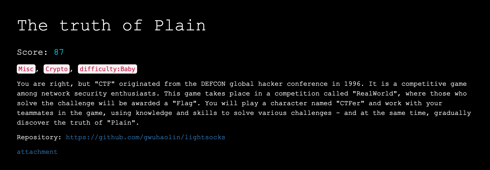

# CTF Write-up: The Truth of Plain [87 pts]

## Challenge Overview:

The challenge presented participants with a multi-faceted task involving a GitHub project, a pcap file, and an encrypted zip. The objective was to decrypt traffic from a lightsocks proxy, which employed a SOCKS5 layer wrapped around an encryption mechanism involving a randomly generated substitution table.

## Stage 1: Investigating the GitHub Project

Participants were provided with a link to a GitHub project ([lightsocks](https://github.com/gwuhaolin/lightsocks)) containing the source code for a socks proxy. This project served as the foundation for the challenge, introducing participants to the intricacies of the lightsocks proxy and its encryption mechanisms.

## Stage 2: Analyzing the pcap File

The participants were given a pcap file containing network traffic from the lightsocks proxy. Upon analysis, it became apparent that one of the streams in the traffic was downloading an encrypted zip file – a crucial element for the decryption process. By closely examining this pcap, participants gained insights into the communication patterns and data exchanges between the client and the lightsocks proxy.

## Stage 3: Decrypting the Encrypted Zip

The encrypted zip file presented a challenge with its own set of complexities. The encryption layer involved a randomly generated substitution table. Participants, however, observed that by comparing the traffic from the pcap, they could discern patterns and differences between the encrypted and decrypted streams. This information allowed them to recreate the substitution table and decrypt the other stream.

## Stage 4: Known Plaintext Attack

With a plaintext version of a file within the decrypted zip, participants leveraged a known plaintext attack. They utilized the tool [pkcrack](https://github.com/keyunluo/pkcrack) to perform the attack on the encrypted zip, eventually recovering a decrypted version of the zip file named "key."

## Stage 5: Unveiling the Flag

The "key" file, obtained through the known plaintext attack, revealed a password. Using this password, participants accessed a second encrypted zip file containing the coveted flag. Decrypting this second zip with the recovered password unveiled the plaintext file containing the flag.

## Conclusion:

"The Truth of Plain" provided participants with a comprehensive challenge, encompassing various stages of decryption and analysis. From understanding the lightsocks proxy and its encryption methods to decrypting traffic, recreating substitution tables, and performing known plaintext attacks, participants navigated a complex puzzle. The challenge showcased the importance of analyzing network traffic, recognizing encryption patterns, and employing various cryptographic techniques to uncover hidden information and ultimately unveil the flag.
